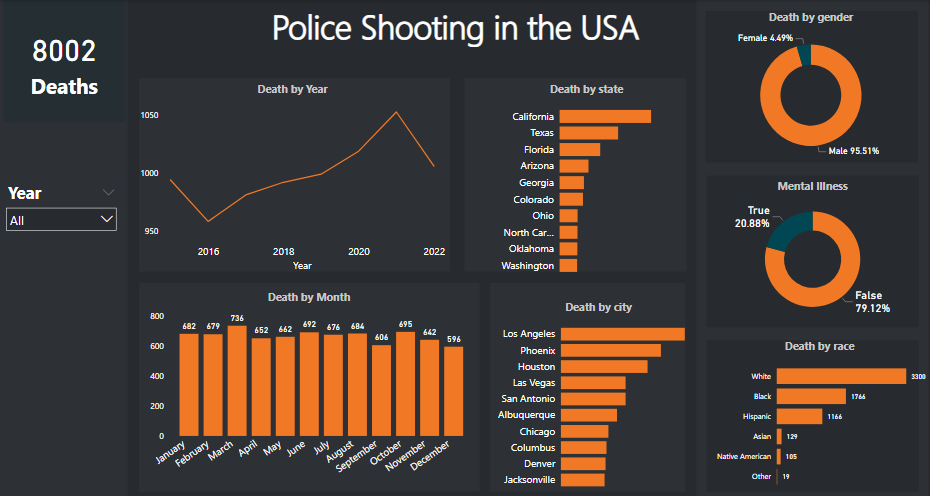

##  Police Shooting in the USA
 

## ***An exploratory analysis of fatal police shooting in the USA***
 

## [Dataset Here](https://github.com/washingtonpost/data-police-shootings)

 

 

#### click on the image to go to dashboard
 

# Introduction

## Police fatal shootings in the United States have been a subject of significant public and media attention in recent years. In the United States, police officers are responsible for the enforcement of laws and the maintenance of public order. However, there have been numerous instances in which police officers have used deadly force, resulting in the death of individuals.

 

    Police shootings are a significant source of violence and trauma in the USA.
    
    According to data compiled by the Washington Post, there have been over 5,
    000 fatal police shootings in the USA between 2015 and 2021. 
    
    These shootings have led to widespread public outrage, protests, and calls for reform. 
    Studying police fatal shootings can help identify patterns and trends in these incidents,
    which can inform the development of policies and practices that may prevent or mitigate 
    future shootings.

## There are several factors that contribute to police fatal shootings in the United States. One factor is the prevalence of gun ownership in the country. The United States has a high rate of gun ownership, with an estimated 120.5 guns per 100 residents. This means that individuals in the United States are more likely to be armed, and police officers may feel threatened or fear for their safety when encountering armed individuals.

 

# Objectives

 

## This project aims to examine the prevalence and circumstances of police fatal shootings in the United States, with a focus on identifying potential contributing factors and exploring potential solutions.

 

## Studying police fatal shootings can help to shed light on issues of racial and social justice. Many of the individuals killed by police in the USA are people of color, and there is evidence to suggest that police are more likely to use deadly force against people of color than against white individuals. This raises important questions about systemic bias in policing and the impact of this bias on communities of color. Understanding the factors that contribute to police fatal shootings can help to identify and address these inequities 

 

    Overall, the goal of this project is to provide a comprehensive 
    understanding of the issue of police fatal shootings in the United States 
    and to offer practical solutions for reducing the frequency and severity of 
    these incidents

 

## Finally, studying police fatal shootings can help to build trust and accountability between law enforcement and the communities they serve. When police officers use deadly force, it is important that the public has confidence that the shooting was justified and that the officers involved will be held accountable for their actions. Studying police fatal shootings can help to identify best practices for conducting investigations into these incidents and for holding officers accountable when necessary.
